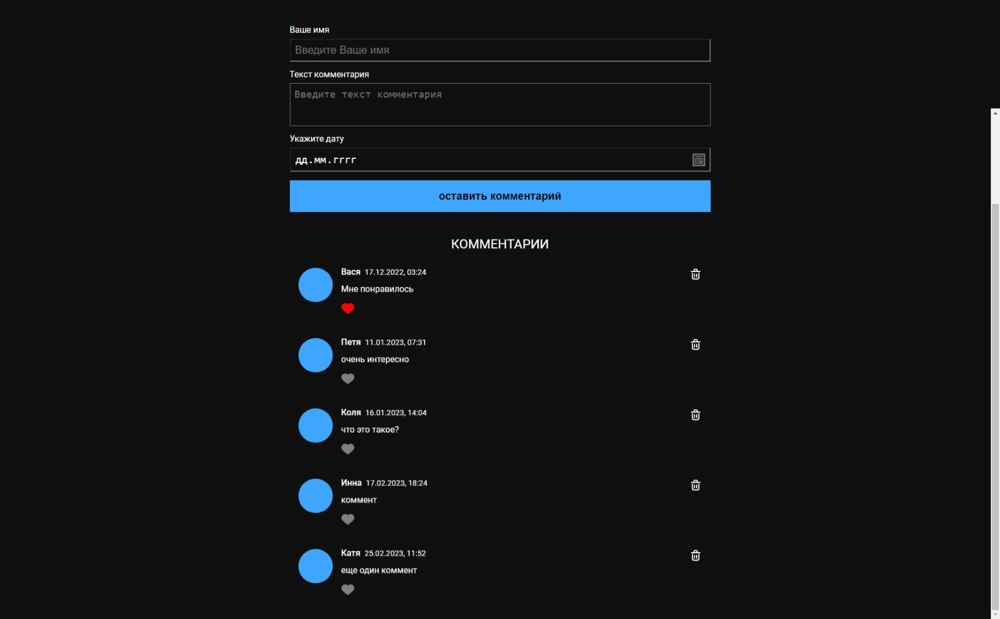
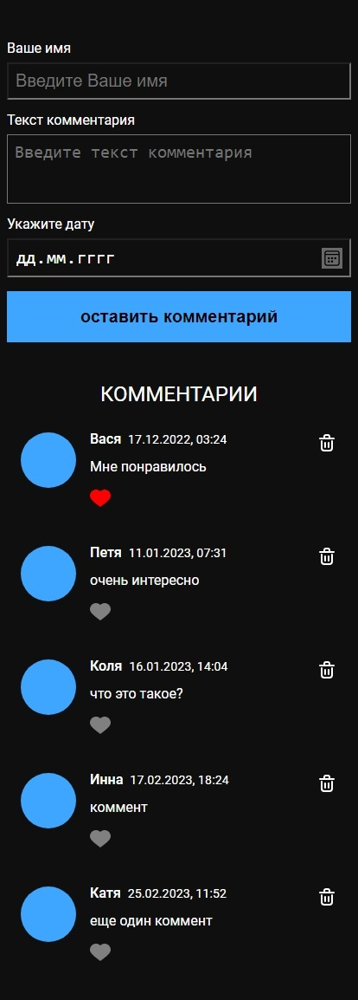

# Список комментариев с формой добавления новых комментариев

Для добавления комментария требуется ввести имя пользователя и 
текст комментария. Ввод даты необязателен, в случае пустого поля
дата и время устанавливаются на текущий момент. Комментарии возможно
удалить при нажатии на кнопку удаления.

## Технологии 

- JavaScript
- SCSS
- Webpack

## Preview
- desktop

- mobile

## Разработка

### Требования 

Для установки и запуска проекта необходим NodeJS v16+

### Установка зависимостей

Для установки зависимостей, выполните команду:

`npm i`

### Запуск Development server

`npm run dev`

### Создание билда

Чтобы выполнить production сборку, выполните команду:

`npm run build`

